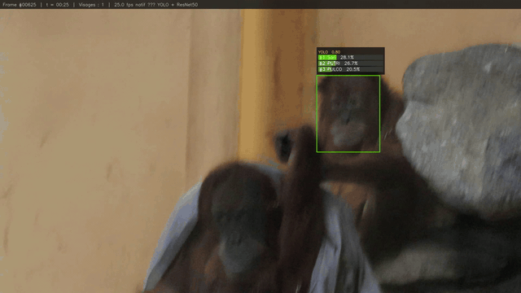
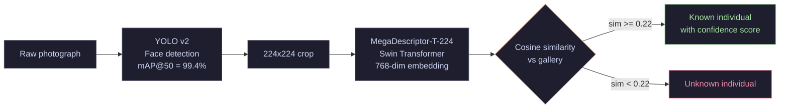
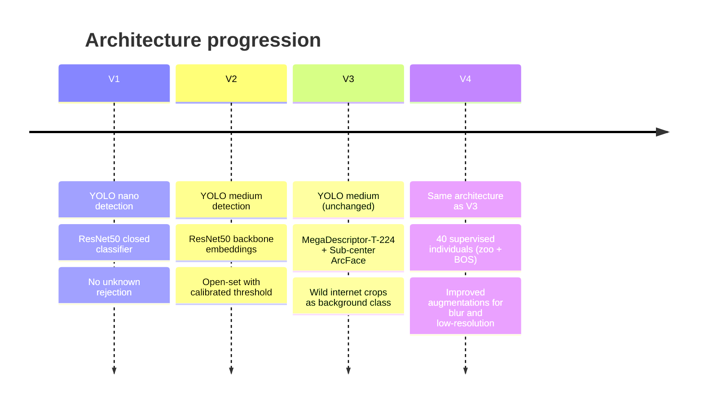
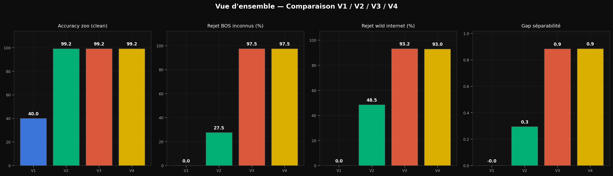
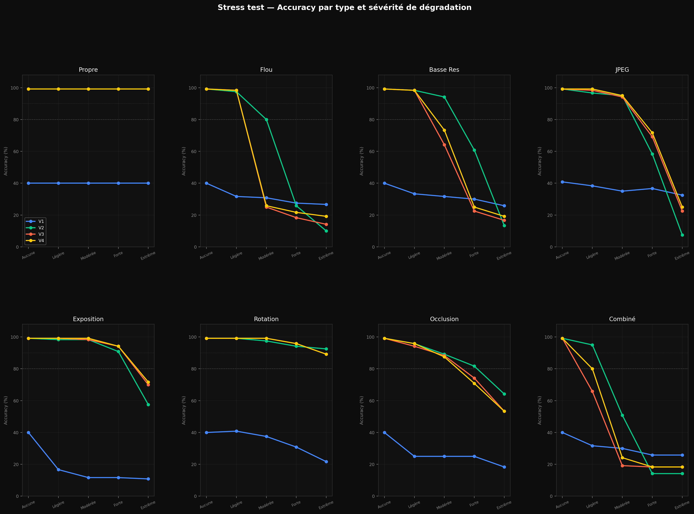
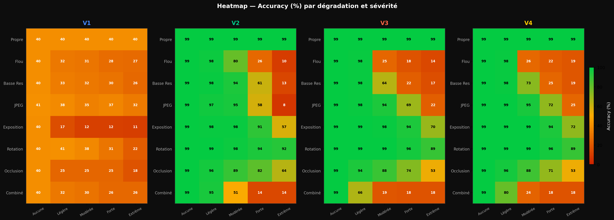
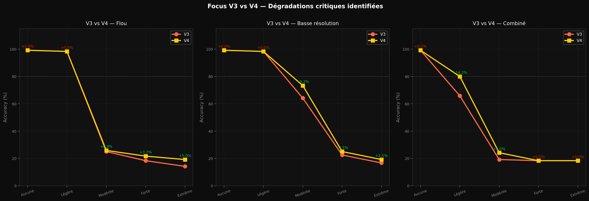
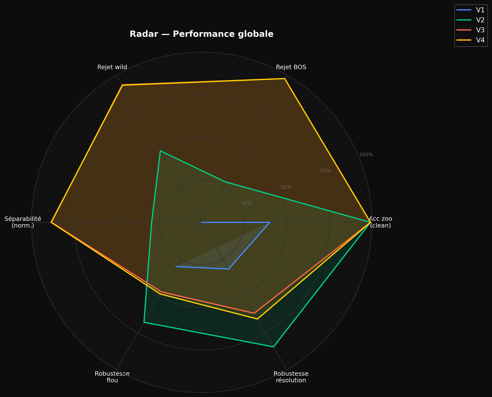

# OrangIdentifier

**Individual facial recognition for Bornean orangutans** — end-to-end pipeline from raw photographs to offline Android deployment.

> CNRS IPHC Strasbourg · BOS Foundation Borneo · May 2026  

---

## Overview

Rangers at BOS Foundation (Borneo Orangutan Survival) need to identify individual orangutans during field patrols. Manual identification across dozens of individuals in rehabilitation is time-consuming and error-prone.

This pipeline produces an Android app that runs **entirely offline** and returns an identity match or "unknown individual" within seconds of taking a photo.

---

## Demo



> V1 pipeline · YOLO face detection + ResNet50 identification · running offline on laptop.  
> Processing a 1 min 30 sec field video takes approximately 2 minutes on an RTX 3050 (YOLO detection + embedding extraction + identity matching).

---

## Inference pipeline



The gallery is a JSON file containing one averaged embedding vector per individual. Adding a new individual requires 10–20 photos, takes under a minute, and requires no retraining.

---

## Four versions



| | V1 | V2 | V3 | **V4** |
|---|---|---|---|---|
| Backbone | ResNet50 | ResNet50 | MegaDescriptor-T | **MegaDescriptor-T** |
| Loss | Cross-entropy | — (reuse V1) | Sub-center ArcFace | **Sub-center ArcFace** |
| Supervised individuals | 10 | 10 | 10 | **40** |
| Zoo accuracy | 96.3% | ~98% | 99.2% | **99.2%** |
| BOS rejection (1622 unseen crops) | none | 27.5% | 97.5% | **97.5%** |
| Wild internet rejection | none | 48.5% | 93.2% | **93.0%** |
| Separability gap | — | 0.294 | 0.883 | **0.885** |
| Inference time (RTX 3050) | 12 ms | 11 ms | 17 ms | **20 ms** |



---

## Results

### Robustness under degraded conditions

Field photos are rarely ideal. Each model was evaluated across 8 degradation types at 5 severity levels to simulate real patrol conditions: motion blur, low resolution, JPEG compression, exposure, rotation, occlusion, and combinations.



**Heatmap — accuracy (%) by degradation and severity**



V4 improves robustness on the two critical failure modes identified in V3:

| Degradation | Severity | V3 | V4 | Gain |
|---|---|---|---|---|
| Low resolution | Moderate | 64.2% | 73.3% | +9.1% |
| Combined (blur + JPEG + resize) | Light | 65.8% | 80.0% | +14.2% |



### Global performance radar



---

## Dataset

| Source | Individuals | Crops | Role |
|--------|-------------|-------|------|
| Zoo Amnéville + Indonesia | 10 | 2,127 | Training (known) |
| BOS Foundation Borneo | 30 | 1,622 | Open-set test only (never seen during training) |
| Internet (iNaturalist, GBIF, web) | unlabeled | 5,429 | Background class during training |

Images are not included in this repository. Contact CNRS IPHC Strasbourg for dataset access.

---

## Models

Download all models automatically:

```bash
python models/download_models.py --version all
```

| File | Used in | Size | Description |
|------|---------|------|-------------|
| `yolo_v1_nano_mAP92.pt` | V1 | 6 MB | YOLO nano — mAP@50 = 91.98% |
| `yolo_v2_medium_mAP99.pt` | V1 → V4 | 85 MB | YOLO medium — mAP@50 = 99.39% |
| `resnet50_classifier_10classes_acc96.pt` | V1 | 90 MB | Closed-set classifier |
| `resnet50_backbone_2048dim.pt` | V2 | 90 MB | Embedding backbone, 2048-dim |
| `megadesc_T_arcface_final_epoch21_acc99.pt` | V3 | 105 MB | ArcFace, 10 individuals |
| `megadesc_T_arcface_v4_40individus_acc99.pt` | **V4** | 105 MB | ArcFace, 40 individuals |

Hosted at [HuggingFace — tit0000/OrangIdentifier](https://huggingface.co/tit0000/OrangIdentifier)

---

## Installation

```bash
conda create -n orangs python=3.10
conda activate orangs
pip install -r requirements.txt
python setup.py
python models/download_models.py
```

Tested on Windows 11 · Python 3.10 · PyTorch 2.4.1+cu124 · RTX 3050 4 GB.

---

## Usage

See [PIPELINE.md](PIPELINE.md) for the complete step-by-step guide.

```bash
# 1. Extract faces from raw photos
python v3_megadesc_arcface_10ind/03_extract_faces_wild.py

# 2. Manual crop review (drag and drop)
python common/review_crops.py path/to/crops/

# 3. Train V4 (recommended)
python v4_megadesc_arcface_40ind/01_train_improved.py

# 4. Export gallery for Android
python v4_megadesc_arcface_40ind/05_export_gallery.py

# 5. Benchmark all versions
python common/benchmark.py
```

---

## Repository structure

```
OrangIdentifier/
├── v1_yolo_nano_resnet50/           YOLO detection + ResNet50 closed-set classifier
├── v2_resnet50_embeddings_openset/  ResNet50 backbone + cosine similarity gallery
├── v3_megadesc_arcface_10ind/       MegaDescriptor-T + Sub-center ArcFace, 10 individuals
├── v4_megadesc_arcface_40ind/       MegaDescriptor-T + ArcFace improved, 40 individuals
├── common/
│   ├── review_crops.py              Unified crop reviewer (replaces all legacy versions)
│   ├── benchmark.py                 V1–V4 comparative benchmark
│   └── stress_test.py               Robustness evaluation under degraded conditions
├── models/
│   ├── download_models.py           Download pretrained weights from HuggingFace
│   └── README.md                    Model catalogue and direct links
├── docs/
│   ├── DOCUMENTATION_V1.md
│   ├── DOCUMENTATION_V2_V3.md
│   └── figures/                     Full benchmark figures (10 graphs)
├── config.yaml                      Single configuration file to adapt for a new species
├── setup.py                         Environment check and cache configuration
├── PIPELINE.md                      Step-by-step usage guide
└── requirements.txt
```

---

## Adapting to another species

The pipeline is designed to be reusable. To apply it to gorillas, chimpanzés, or other primates:

1. Edit `config.yaml` — set `species`, `project_name`, and data paths
2. Annotate photos using `common/review_crops.py`
3. Retrain YOLO on the new annotations
4. Follow the V3 or V4 pipeline

MegaDescriptor-T is pretrained on animal re-identification across dozens of species and generalizes well to new contexts with limited data.

---

## References

Čermák et al. (2024). *WildlifeDatasets: An open-source toolkit for animal re-identification.* WACV 2024, pp. 5953–5963. [CVF](https://openaccess.thecvf.com/content/WACV2024/html/Cermak_WildlifeDatasets_An_Open-Source_Toolkit_for_Animal_Re-Identification_WACV_2024_paper.html)

Deng et al. (2019). *ArcFace: Additive Angular Margin Loss for Deep Face Recognition.* CVPR 2019. [CVF](https://openaccess.thecvf.com/content_CVPR_2019/html/Deng_ArcFace_Additive_Angular_Margin_Loss_for_Deep_Face_Recognition_CVPR_2019_paper.html) · [arXiv](https://arxiv.org/abs/1801.07698)

Deng et al. (2020). *Sub-center ArcFace: Boosting Face Recognition by Large-scale Noisy Web Faces.* ECCV 2020. [Springer](https://link.springer.com/chapter/10.1007/978-3-030-58621-8_43) · [PDF](https://www.ecva.net/papers/eccv_2020/papers_ECCV/papers/123560715.pdf)

Liu et al. (2021). *Swin Transformer: Hierarchical Vision Transformer using Shifted Windows.* ICCV 2021 (Best Paper). [CVF](https://openaccess.thecvf.com/content/ICCV2021/html/Liu_Swin_Transformer_Hierarchical_Vision_Transformer_Using_Shifted_Windows_ICCV_2021_paper.html) · [arXiv](https://arxiv.org/abs/2103.14030)

Otarashvili, L. (2023). *MiewID: Open-source Wildlife Re-identification.* Conservation X Labs. [GitHub](https://github.com/WildMeOrg/wbia-plugin-miew-id) · [HuggingFace](https://huggingface.co/conservationxlabs/miewid-msv2)

Jocher, G., Chaurasia, A., & Qiu, J. (2023). *Ultralytics YOLO* (Version 8.0.0). [GitHub](https://github.com/ultralytics/ultralytics)

---
