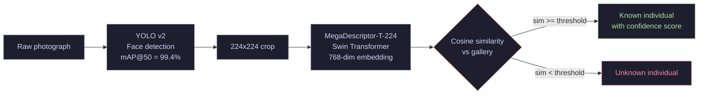
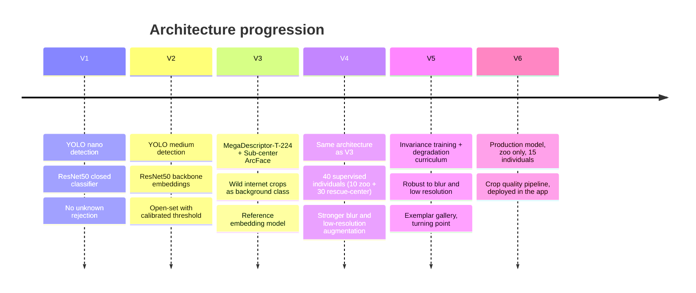
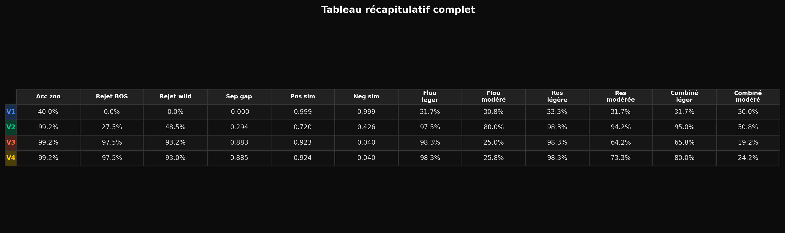
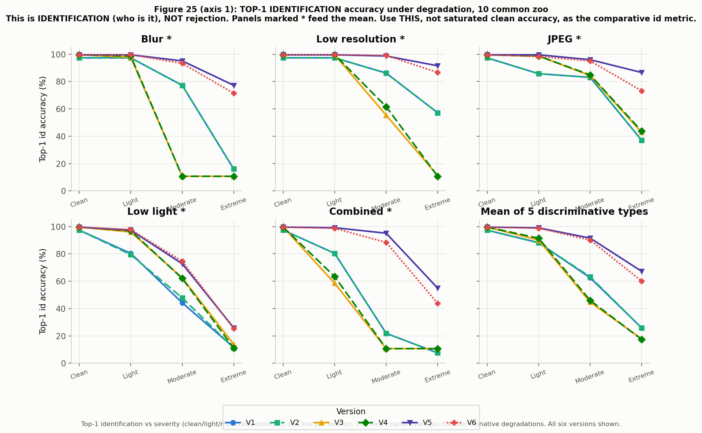
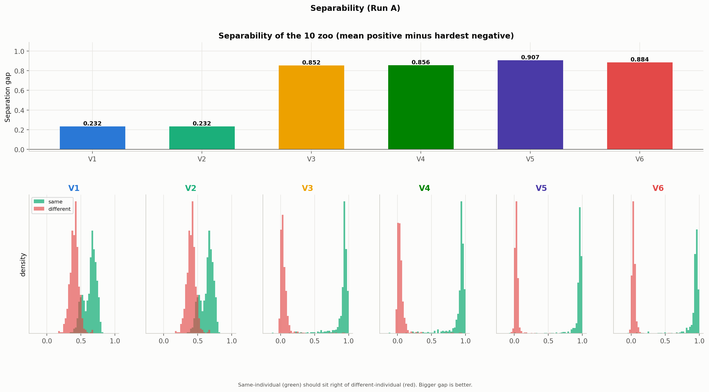
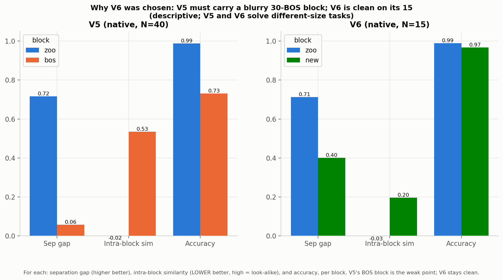

# OrangIdentifier

**Individual facial recognition for Bornean orangutans.** End-to-end pipeline from raw photographs to an identity gallery, deployed offline in an Android app.

---

## Overview

This pipeline trains a face detector and an individual identification model from a collection of labeled photographs, then exports the result as a lightweight **gallery JSON** (one embedding vector per individual).

The gallery can be loaded into any app (Android, desktop, embedded). Adding a new individual requires 10 to 20 photos, takes under a minute, and requires no retraining.

> **Android app** is in a separate repository: https://github.com/tit-exe/OrangIdentifier_AndroidApp

---

## Demo


> V1 pipeline, YOLO face detection plus ResNet50 identification, running offline on a laptop.
> Processing a 1 min 30 sec field video takes about 2 minutes on an RTX 3050 (detection, embedding extraction and identity matching).

---

## Inference pipeline



---

## Six versions



The six versions were compared with a single fair evaluation: the same session-level train/test split, galleries rebuilt identically, and each version scored for open-set rejection only on identities it never saw during training. Two complementary views are reported.

**Axis 1, controlled comparison** (the 10 zoo individuals common to every version, so only the backbone changes):

| | V1 | V2 | V3 | V4 | V5 | **V6** |
|---|---|---|---|---|---|---|
| Backbone | ResNet50 | ResNet50 | MegaDescriptor-T | MegaDescriptor-T | MegaDescriptor-T | **MegaDescriptor-T** |
| Loss | Cross-entropy | reuse V1 | Sub-center ArcFace | Sub-center ArcFace | ArcFace + invariance | **ArcFace + invariance** |
| Supervised individuals | 10 | 10 | 10 | 40 | 40 | **15** |
| Clean identification (10 zoo) | 96.5% | 96.5% | 99.2% | 99.2% | 99.7% | **99.2%** |
| Separability gap | 0.23 | 0.23 | 0.85 | 0.86 | 0.91 | **0.88** |
| Unknown rejection (ROC AUC) | 0.83 | 0.83 | 0.998 | 0.99 | 0.99 | **0.999** |
| Identification under moderate blur | 77% | 77% | 11% | 11% | 95% | **93%** |
| Role | first system | open-set | reference model | 40 individuals | invariance turning point | **production (deployed)** |

> **Reading the rejection column.** A version can only be tested for "rejection" on individuals it never learned. V1, V2, V3 and V6 are scored against the rescue-center (BOS) animals they never saw. V4 and V5 were trained on the BOS animals, so they are instead scored against the 5 new zoo individuals they never saw. Every number therefore uses a legitimate, never-trained unknown set. Clean identification on good zoo crops saturates from V3 onward, so it is not where the versions differ. The real separation appears under degradation (see below).



---

## Results

### Identification under degraded conditions

Field photos are rarely ideal. Each version was re-tested on the same crops after blur, low resolution, JPEG compression and low light at increasing severity, to simulate real patrol conditions. This is the metric that actually separates the versions.



V3 and V4 collapse to chance level (around 11%, for a 10-way problem) as soon as blur becomes moderate. V5 introduced an invariance loss and a degradation curriculum, and holds above 90%. V6 keeps that robustness for the deployed zoo model. This is why V5, not V4, is the real robustness turning point.

### Separability and rejection



The move from ResNet50 to MegaDescriptor-T with Sub-center ArcFace is the largest single jump: the separability gap between an individual and its nearest competitor rises from about 0.23 to about 0.85 or more. Rejection of never-seen individuals follows the same pattern.


### Why V6 and not V5

On the shared 10 zoo individuals, V5 and V6 look equivalent. The difference appears when each model is evaluated on its own full task (Axis 2, descriptive, so the numbers are not directly comparable because the number of individuals differs).

| Version | Individuals it must recognise | Native accuracy (micro / macro) | BOS separability gap |
|---|---|---|---|
| V3 | 10 zoo | 99.2% / 99.2% | not applicable |
| V4 | 40 (10 zoo + 30 BOS) | 73.7% / 55.6% | -0.01 |
| V5 | 40 (10 zoo + 30 BOS) | 87.5% / 79.5% | +0.06 |
| **V6** | 15 (10 zoo + 5 new) | **97.9% / 98.2%** | not applicable |

The rescue-center animals are almost inseparable: V4 cannot tell them apart at all (a negative gap means a crop is as close to a wrong individual as to itself), and even V5, with a dedicated spreading loss, only reaches a weak +0.06. Averaged per individual, V5 identifies fewer than 80% of its 40 individuals. V6 dropped the BOS animals entirely and focused on the 15 zoo individuals of the actual deployment target, where it reaches 98%. That is the reason V6 is the production model.



---

## Dataset

| Source | Individuals | Crops | Role |
|--------|-------------|-------|------|
| Captive collection (zoo) | 15 | 2,127 + 865 | Training (known individuals) |
| Field rescue center (BOS) | 30 | 1,622 | Supervised in V4/V5, unknown test set for V3/V6 |
| Internet (iNaturalist, GBIF, web) | unlabeled | 5,429 | Background class during training |

Images are not included in this repository.

---

## Models

Download all models automatically:

```bash
python models/download_models.py --version all
```

| File | Used in | Size | Description |
|------|---------|------|-------------|
| `yolo_v1_nano_mAP92.pt` | V1 | 6 MB | YOLO nano, mAP@50 = 91.98% |
| `yolo_v2_medium_mAP99.pt` | V1 to V6 | 85 MB | YOLO medium, mAP@50 = 99.39% |
| `resnet50_classifier_10classes_acc96.pt` | V1 | 90 MB | Closed-set classifier |
| `resnet50_backbone_2048dim.pt` | V2 | 90 MB | Embedding backbone, 2048-dim |
| `megadesc_T_arcface_final_epoch21_acc99.pt` | V3 | 105 MB | ArcFace, 10 individuals |
| `megadesc_T_arcface_v4_40individuals_acc99.pt` | V4 | 105 MB | ArcFace, 40 individuals |
| `megadesc_T_arcface_v5_invariance_acc99.pt` | V5 | 105 MB | ArcFace + invariance, 40 individuals |
| `megadesc_T_arcface_v6_15ind_acc98.pt` | **V6** | 105 MB | Production, 15 zoo individuals |
| `megadesc_v6_backbone.tflite` | V6 (app) | 112 MB | V6 backbone for the Android app |

Hosted at [HuggingFace: tit0000/OrangIdentifier](https://huggingface.co/tit0000/OrangIdentifier)

---

## Installation

```bash
conda create -n orangs python=3.10
conda activate orangs

# PyTorch with CUDA (plain pip installs a CPU-only build)
pip install torch==2.4.1+cu124 torchvision==0.19.1+cu124 \
    --index-url https://download.pytorch.org/whl/cu124

# All other dependencies
pip install timm==0.9.16 ultralytics==8.2.0 Pillow==10.3.0 \
    opencv-python==4.9.0.80 numpy==1.26.4 scikit-learn==1.4.2 \
    umap-learn==0.5.6 matplotlib==3.9.0 PyQt5==5.15.10 \
    tqdm==4.66.4 huggingface_hub==0.23.2

python check_env.py
python models/download_models.py
```

Tested on Windows 11, Python 3.10, PyTorch 2.4.1+cu124, RTX 3050 4 GB.

---

## Usage

See [PIPELINE.md](PIPELINE.md) for the complete step-by-step guide.

```bash
# 1. Extract faces from raw photos
python v1_yolo_nano_resnet50/04_extract_crops.py

# 2. Manual crop review (drag and drop)
python common/review_crops.py

# 3. Train the production model (V6, zoo only)
python v6_megadesc_arcface_15ind/02_train.py

# 4. Export the backbone to TFLite for the app (needs WSL, see maintenance/)
python v6_megadesc_arcface_15ind/05_export_tflite.py

# To simply UPDATE the deployed app (add animals or retrain), follow maintenance/
# It is a plain-language, step-by-step guide written for a non-specialist.
```

---

## Repository structure

```
OrangIdentifier/
├── v1_yolo_nano_resnet50/           YOLO detection + ResNet50 closed-set classifier
├── v2_resnet50_embeddings_openset/  ResNet50 backbone + cosine similarity gallery
├── v3_megadesc_arcface_10ind/       MegaDescriptor-T + Sub-center ArcFace, 10 individuals
├── v4_megadesc_arcface_40ind/       MegaDescriptor-T + ArcFace, 40 individuals
├── v5_megadesc_arcface_invariance/  MegaDescriptor-T + invariance training, 40 individuals
├── v6_megadesc_arcface_15ind/       Production model, 15 zoo individuals (deployed)
├── maintenance/                     Plain-language guide to update the deployed app
├── common/
│   ├── review_crops.py              Unified crop reviewer (replaces all legacy versions)
│   └── config_loader.py             Single source of truth for paths and settings
├── models/
│   ├── download_models.py           Download pretrained weights from HuggingFace
│   └── README.md                    Model catalogue and direct links
├── docs/
│   └── figures/                     Cross-version evaluation figures
├── config.yaml                      Single configuration file to adapt for a new species
├── check_env.py                     Environment check and setup instructions
├── PIPELINE.md                      Step-by-step usage guide
├── QUICKSTART.md                    Quick start guide
└── requirements.txt
```

---

## Adapting to another species

The pipeline is designed to be reusable. To apply it to gorillas, chimpanzees, or any other species:

1. Edit `config.yaml`: set `species`, `project_name` and data paths
2. Collect labeled photos, one subfolder per individual in `data/photos/`
3. Annotate faces using `tools/annotate_keyboard.py`
4. Retrain YOLO on the new annotations
5. Follow the V3 to V6 pipeline

MegaDescriptor-T is pretrained on animal re-identification across dozens of species and generalizes well to new contexts with limited data.

---

## Note on this repository

The code here is a cleaned-up version of what was actually used during development. The original work involved a lot of trial and error, many different scripts and messy iterations. This repository is a reorganised version of that.

Everything should work as documented, but if something breaks, feel free to open an issue or contact me directly. You can also drop the relevant files into an AI assistant such as [Claude](https://claude.ai): it reads the whole codebase and can usually figure out what went wrong.

---

## References

Čermák et al. (2024). *WildlifeDatasets: An open-source toolkit for animal re-identification.* WACV 2024, pp. 5953–5963. [CVF](https://openaccess.thecvf.com/content/WACV2024/html/Cermak_WildlifeDatasets_An_Open-Source_Toolkit_for_Animal_Re-Identification_WACV_2024_paper.html)

Deng et al. (2019). *ArcFace: Additive Angular Margin Loss for Deep Face Recognition.* CVPR 2019. [CVF](https://openaccess.thecvf.com/content_CVPR_2019/html/Deng_ArcFace_Additive_Angular_Margin_Loss_for_Deep_Face_Recognition_CVPR_2019_paper.html) · [arXiv](https://arxiv.org/abs/1801.07698)

Deng et al. (2020). *Sub-center ArcFace: Boosting Face Recognition by Large-scale Noisy Web Faces.* ECCV 2020. [Springer](https://link.springer.com/chapter/10.1007/978-3-030-58621-8_43) · [PDF](https://www.ecva.net/papers/eccv_2020/papers_ECCV/papers/123560715.pdf)

Liu et al. (2021). *Swin Transformer: Hierarchical Vision Transformer using Shifted Windows.* ICCV 2021 (Best Paper). [CVF](https://openaccess.thecvf.com/content/ICCV2021/html/Liu_Swin_Transformer_Hierarchical_Vision_Transformer_Using_Shifted_Windows_ICCV_2021_paper.html) · [arXiv](https://arxiv.org/abs/2103.14030)

Otarashvili, L. (2023). *MiewID: Open-source Wildlife Re-identification.* Conservation X Labs. [GitHub](https://github.com/WildMeOrg/wbia-plugin-miew-id) · [HuggingFace](https://huggingface.co/conservationxlabs/miewid-msv2)

Jocher, G., Chaurasia, A., & Qiu, J. (2023). *Ultralytics YOLO* (Version 8.0.0). [GitHub](https://github.com/ultralytics/ultralytics)

---
